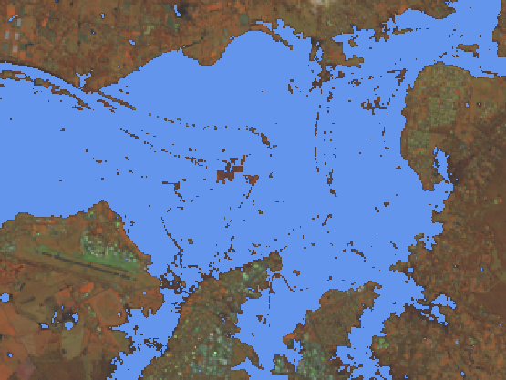
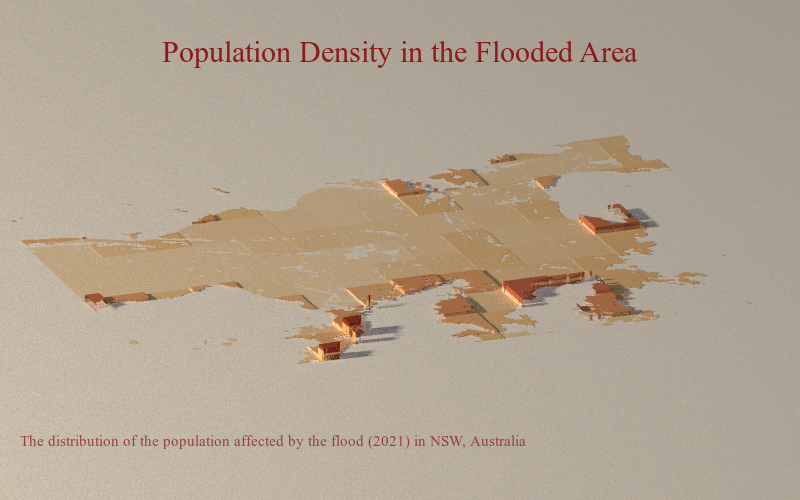

# Analysis of Affected Population Density by Flood in 2021 in Australia

## Information
Please download the data from the Google Drive link and load the data into the script at the corresponding passages by adjusting the path to your directory. More explanations regarding the performed workflow can be find as comments in the script.

## Analysis & Results
This project compares different techniques to extract the inundated area, to calculate the percentage of affected people in the study area and to display the population affected by this flood in R. The aim is to identify areas with the highest concentration of affected people and to show the impact the flood has on this population in the specific area regarding its severity.

First, the inundated area needs to be extracted. An effective and fast approach is masking the flooded area by thresholding like the Normalized Difference Water Index (NDWI), using the green and near infrared band, or the Modified Normalized Difference Water Index (MNDWI), using the green and the shortwave infrared band. The result will be the inundated areas based on the threshold value represented in a binary mask. Another feasible method is doing a supervised classification of the Landsat scene and extracting the pixels classified as water. 

The results can be compared by plotting each mask over the original satellite image and by determining which approach represented the flood the best.

The MNDWI-mask is chosen and used for the population analysis with Rayshader based on population density data from 2020. Rayshader offers many visualisation options. The result is a PNG-image displaying the distribution of the affected population with shadows for three-dimensionality as well as supportive text. 

## Discussion
Unfortunately, there was no feasible population data of the exact same year as the flood happens available, hence, it is not certain, that the resulting image represents the true situation. Besides, the final image would look much better if it represented a larger area.
Nonetheless, the script shows the workflow to perform the population density analysis and visualisation. 
